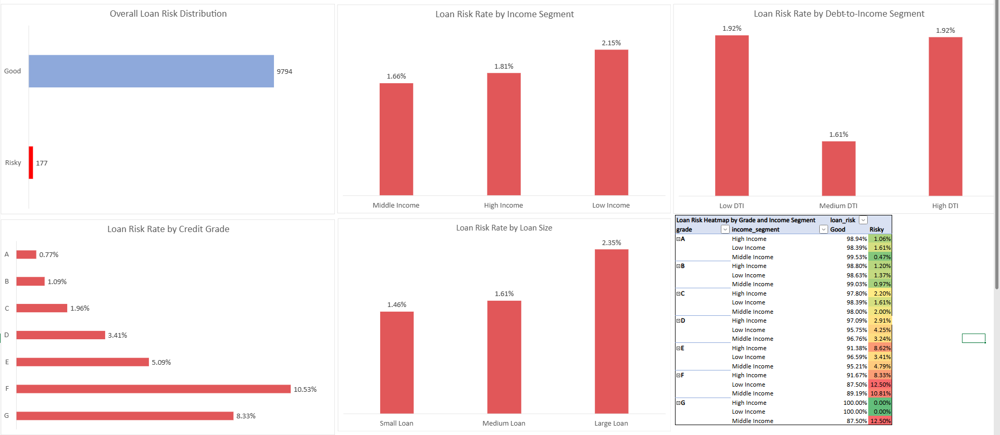

# Loan Portfolio Risk Analysis

## Project Background

Proyek ini bertujuan untuk menganalisis profil borrower guna mengidentifikasi karakteristik peminjam yang memiliki risiko gagal bayar (default) paling tinggi. Analisis dilakukan menggunakan Microsoft Excel dengan pendekatan Exploratory Data Analysis (EDA) untuk menghasilkan insight yang dapat mendukung proses penilaian kredit.

**Business Problem**

> Which borrower profiles have the highest probability of default?

---

## Dataset Overview

Dataset berisi data historis pinjaman, di mana setiap baris merepresentasikan satu borrower.

Variabel utama yang digunakan:

- Annual Income
- Debt-to-Income Ratio (DTI)
- Credit Grade
- Loan Amount
- Loan Status

Untuk mendukung analisis, dibuat beberapa kolom turunan:

- Loan Risk (Good / Risky)
- Income Segment
- DTI Segment
- Loan Amount Segment

---

## Data Preparation

Sebelum analisis dilakukan, dataset dibersihkan dengan menghapus:

- Duplicate records
- Blank rows
- Invalid income values
- Missing DTI values

Seluruh data bermasalah memiliki proporsi kurang dari **1%** sehingga tidak memberikan pengaruh signifikan terhadap hasil analisis.

---

## Tools

- Microsoft Excel
- Pivot Table
- Conditional Formatting
- Data Visualization

---

## Analysis Preview

---

## Key Findings

- Hanya **1.78%** pinjaman yang termasuk kategori **Risky**, sedangkan **98.22%** lainnya berada pada kategori **Good**.
- Borrower dengan **Low Income** memiliki tingkat risiko tertinggi dibandingkan kelompok income lainnya.
- **Credit Grade** merupakan faktor yang paling berpengaruh terhadap risiko default, dengan **Grade F** memiliki risk rate tertinggi (**10.53%**).
- Borrower dengan **Large Loan** menunjukkan tingkat risiko lebih tinggi dibandingkan pinjaman kecil maupun menengah.
- **Debt-to-Income (DTI)** tidak menunjukkan hubungan yang konsisten terhadap risiko default pada dataset ini.
- Kombinasi **Grade F + Low Income** merupakan profil borrower dengan risiko tertinggi (**12.50%**).

---

## Recommendations

- Perketat evaluasi kredit untuk borrower dengan **Credit Grade** rendah.
- Terapkan penilaian tambahan pada pengajuan pinjaman dengan nominal besar.
- Gunakan **Credit Grade** sebagai indikator utama dalam proses penilaian risiko.
- Kembangkan model credit scoring yang menggabungkan grade, income, dan loan amount.

---

## Business Relevance

Analisis ini relevan untuk berbagai institusi keuangan seperti **bank, pegadaian, fintech lending,** dan **perusahaan pembiayaan** sebagai dasar dalam meningkatkan kualitas keputusan pemberian pinjaman.
